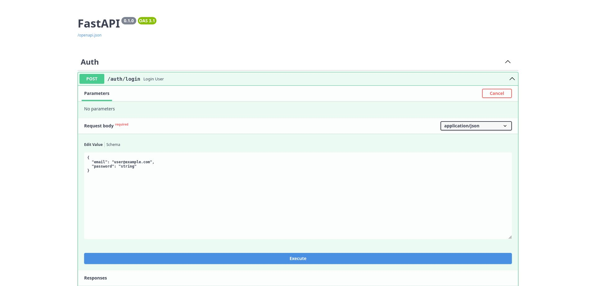
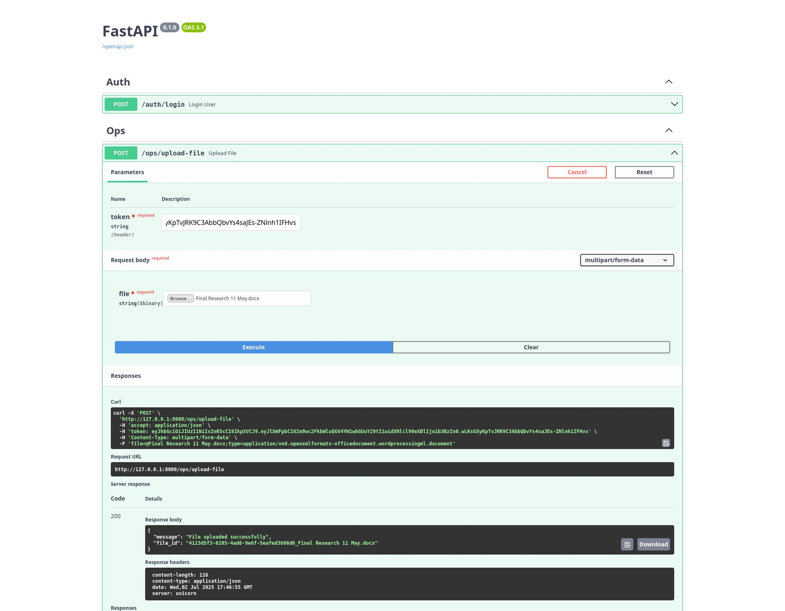
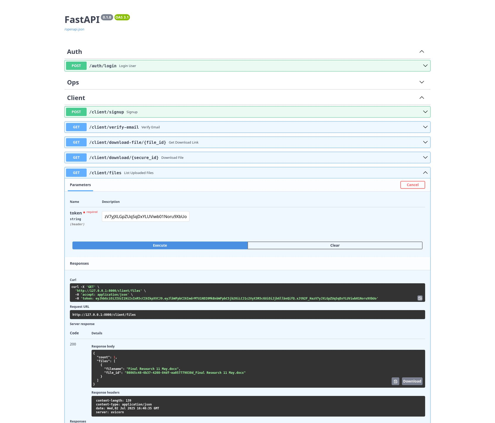
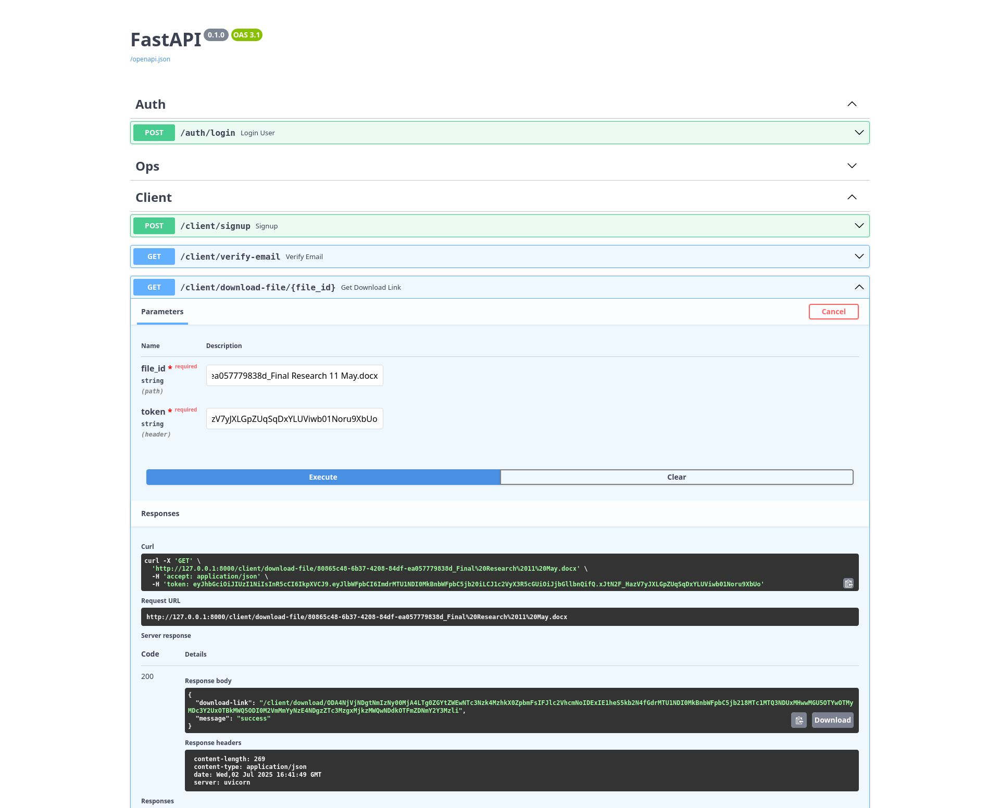
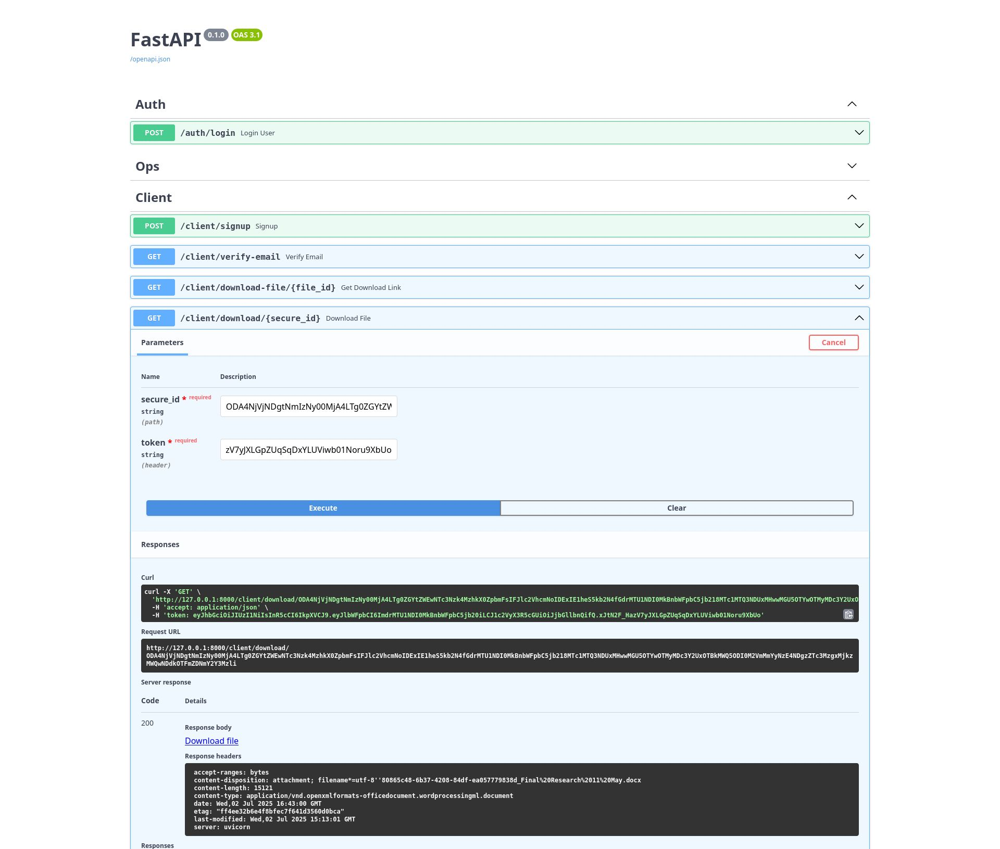

# 🔐 Secure File Sharing System

A robust, role-based file-sharing system built with **FastAPI** and **MongoDB**, enabling two types of users — **Ops Users** and **Client Users** — to securely upload and download files. The system features secure JWT-based authentication, email verification, encrypted download URLs, and strict role-level access control.

---

## ✨ Features

### 👨‍💼 Ops User

- ✅ Login
- ✅ Upload `.pptx`, `.docx`, `.xlsx` files only

### 🧑‍💻 Client User

- ✅ Sign Up (returns verification link)
- ✅ Email Verification
- ✅ Login (only after verifying email)
- ✅ Get Encrypted File Download Link
- ✅ Download File via Encrypted URL
- ✅ List All Uploaded Files

---

## 🔐 Security Highlights

- JWT Authentication
- Role-based access guards (`ops`, `client`)
- Encrypted, time-bound download links (HMAC-based)
- Password hashing via `bcrypt`
- Email verification via tokenized link
- MongoDB with async motor client

---

## 🛠️ Tech Stack

| Layer        | Technology            |
| ------------ | --------------------- |
| Backend      | FastAPI               |
| Database     | MongoDB (Atlas/local) |
| Auth         | JWT (Python-Jose)     |
| Email        | aiosmtplib + SMTP     |
| Passwords    | bcrypt                |
| File Uploads | Multipart form        |
| Testing      | pytest + httpx        |
| Deployment   | Uvicorn / Docker      |

---

## 📂 Project Structure

```
.
├── main.py
├── routes/
│   ├── auth.py
│   ├── client.py
│   └── ops.py
├── utils/
│   ├── auth.py
│   ├── encrypt.py
│   ├── token.py
│   └── email.py
├── db/
│   └── mongo.py
├── files/         # Uploaded files
├── test/          # Test cases
├── requirements.txt
└── README.md
```

---

## 📦 Installation

1. **Clone the Repository**

   ```bash
   git clone https://github.com/GauravOP-03/Ev_assignment.git
   cd Ev_assignment
   ```

2. **Create a Virtual Environment**

   ```bash
   python -m venv evAssignment
   source venv/bin/activate  # Windows: venv\Scripts\activate
   ```

3. **Install Dependencies**

   ```bash
   pip install -r requirements.txt
   ```

4. **Configure Environment Variables**

   Create a `.env` file:

   ```
   MONGO_URL=mongodb+srv://<user>:<pass>@cluster.mongodb.net/db
   AUTH_SECRET=super_secure_key
   URL_SECRET=super_secure_key
   SMTP_USER=your_email@gmail.com
   SMTP_PASS=your_app_password  # App password for Gmail
   ```

5. **Run the Server**

   ```bash
   uvicorn main:app --reload
   ```

   Visit: http://localhost:8000/docs

---

## 🧪 Run Tests

```bash
pytest
```

Make sure MongoDB is running and your `.env` file is configured before running tests.

---

## 🚀 Deployment Plan

- Use Docker or Render for deploying FastAPI backend
- Use MongoDB Atlas for cloud DB
- Secure .env variables using platform secrets
- Optional: Set up NGINX or Traefik for reverse proxy & HTTPS

---

## 📧 Email Verification

- Email tokens are sent via SMTP using aiosmtplib
- Links expire after 30 minutes
- Recommended to use providers like Resend, SendGrid, or Mailgun in production

---

## ✅ TODOs

- [x] JWT Auth with roles
- [x] Email verification
- [x] Secure upload/download
- [x] Test cases with pytest
- [x] Docker

---

## 📸 Screenshots

### 🔐 Login Page



### 📂 File Upload & List Page




### 📧 Email Verification & Download




---

## 🌐 Live Demo

🔗 [Click here to view the live project](https://ev-assignment.onrender.com/docs)

---

## 🧑‍💼 Ops User Credentials

> **Username:** `opsuser@example.com`  
> **Password:** `yourpassword123`

> ⚠️ **Note:** These credentials are for demo purposes only.

---

👨‍💻 Author

Made with ❤️ by [Gaurav Kumar]

> This project was built as part of a secure file-sharing assignment to demonstrate real-world backend architecture, authentication, file handling, and testability.
